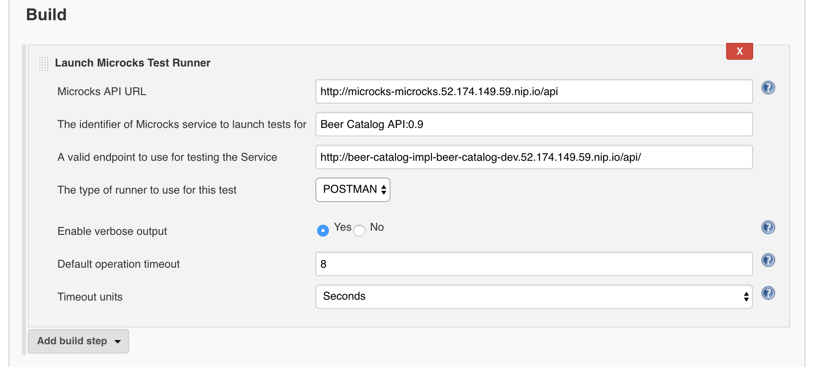

	

		

      <h1 class="page-title arvo">Automating Microcks tests with Jenkins</h1>
    

	

  

    <section id="jenkins-info" class="article">
      <h2 class="arvo">Microcks Jenkins plugin</h2>
      

        Microcks provides a Jenkins plugin that you may find here: <a href="https://github.com/microcks/microcks-jenkins-plugin">microcks-jenkins-plugin</a>. This plugin allows your Jenkins builds and jobs to delegate the tests of microservices or API you just deployed to Microcks server. See <a href="../../using/tests/">this page on Tests</a> for more informations on running tests with Microcks.
      

			

				Using this plugin, it is really easy to integrate tests stages within your Continuous Integration / Deployment / Delivery pipeline. Microcks Jenkins plugin delegates tests realization and assertions checking to Microcks, wait for the end of tests or a configured timeout and just pursue or fail the current job depending on tests results.
			

			<h3 class="arvo">Getting raw plugin</h3>
      

        While not being distributed yet as an official Jenkins plugin, Microcks Jenkins plugin is available and can be downloaded from <a href="http://central.maven.org/maven2/io/github/microcks/microcks-jenkins-plugin/0.1.0/microcks-jenkins-plugin-0.1.0.hpi">Central Maven repository</a>. Just get the <a href="http://central.maven.org/maven2/io/github/microcks/microcks-jenkins-plugin/0.1.0/microcks-jenkins-plugin-0.1.0.hpi">HPI file</a> and install it on your Jenkins master <a href="https://jenkins.io/doc/book/managing/plugins/">your preferred way</a>.
      

			<h3 class="arvo">Building an OpenShift Jenkins master embedding plugin</h3>
			

				A common option for running Jenkins is through OpenShift platform. In that case, you may want to create your own custom Jenkins master container image embedding this plugin. While there's <a href="https://github.com/clerixmaxime/custom-jenkins">many ways of building such images</a>, as Microcks plugin is not yet an official Jenkins plugin, we provide our own OpenShift configuration for that.
			

			

				Given you have an OpenShift installation running and you're logged on it, just execute that command from terminal: 
				<code>oc create -f https://raw.githubusercontent.com/microcks/microcks-jenkins-plugin/master/openshift-jenkins-master-bc.yml</code> 

				 
				This should start a `Build` and then create an `ImageStream` called `microcks-jenkins-master` in your current project. After few minutes, a `microcks-jenkins-master:latest` container image should be available and you may be able to reference it as a bootstrap when creating a new Jenkins Service on OpenShift.
			

    </section>

		<section id="usage" class="article">
			<h2 class="arvo">Using Microcks Jenkins plugin</h2>
			

				Jenkins plugins may be used
			

			<h3 class="arvo">Simple build step configuration</h3>
			

			

			
			

			

			<h3 class="arvo">DSL plugin usage</h3>
			

				<pre><code>
				node('maven') {
				  stage ('build') {
				    // ...
				  }
				  stage ('deployInDev') {
				    // ...
				  }
				  stage ('testInDev') {
				    // Add Microcks test here.
				    microcksTest(apiURL: 'http://microcks-microcks.52.174.149.59.nip.io/api',
				      serviceId: 'Beer Catalog API:0.9',
				      testEndpoint: 'http://beer-catalog-impl-beer-catalog-dev.52.174.149.59.nip.io/api/',
				      runnerType: 'POSTMAN', verbose: 'true')
				  }
				  stage ('promoteToProd') {
				    // ...
				  }
				  stage ('deployToProd') {
				    // ...
				  }
				}
				</code></pre>
			

		</section>
  

