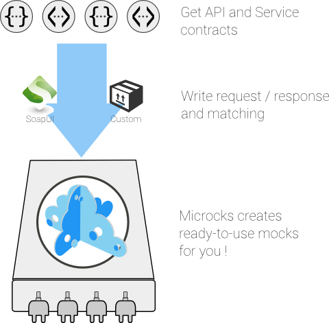

	

		

        <h2 class="arvo">The communication and runtime tool for your Micro-services Mocks</h2>
        
    

	

	

    <section id="features">
      

        

          <i class="fa fa-users fa-4x feature-icon"></i>
          Business Friendly
          <blockquote class="feature-text">Use the tool your business expert knows: SoapUI or whatever! No need to learn a new DSL or configuration syntax.</blockquote>
        

        

          <i class="fa fa-refresh fa-4x feature-icon"></i>
          Continuous Integration
          <blockquote class="feature-text">Integrate seemlessly in your continuous build or pipelines.</blockquote>
        

        

          <i class="fa fa-rocket fa-4x feature-icon"></i>
          Scalable
          <blockquote class="feature-text">Scale to hundreds of mocks, billions of hits on a single instance.</blockquote>
        

      

    </section>
    <section id="whatis" class="article">
      <h2 class="arvo">What's Microcks?</h2>

      
Microcks helps providers of API and micro-services to rapidly deliver :
        <ul>
          <li>A <strong>comprehensible vision of their API</strong>, exposing sample requests and responses as well as base functionnal rules (cases when API responds <code>A</code> or <code>B</code> or raises exceptions)</li>
          <li>A set of <strong>testing environments</strong> to allow API consumers or System Under Tests to use API even if implementation is not finished!</li>
          <li><strong>Contract testing plans</strong> of their API, allowing them to run, record and compare contract tests runned againts different environments.</li>
        </ul>
      

      
When deploying API, micro-services or SOA practices at large scale, Microcks solves the problems of <strong>providing and sharing
      consistent documentation and mocks</strong> to the involved teams. It acts as a central repository and server that can be used for 
      browsing but also by your Continuous Integration builds or pipelines.

      
Finally, Microcks does not impose a new configuration or Domain Specific Language to describe your mocks. It uses the contracts
      and provides <strong>binding with SoapUI</strong> (with some naming conventions). Your business expert describe requests and responses
      with the tool he knows, Microcks translates it and can do it repeatdely every time new mocks appears into your SCM.

    </section>
	

