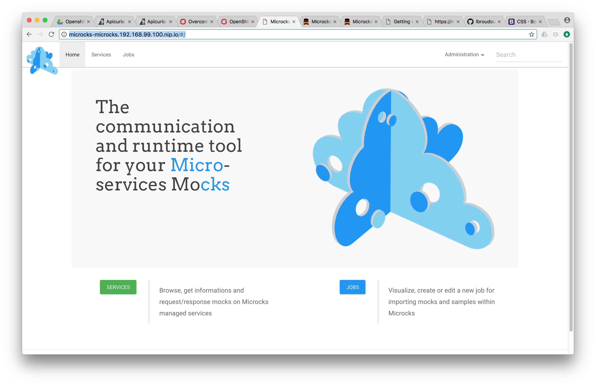
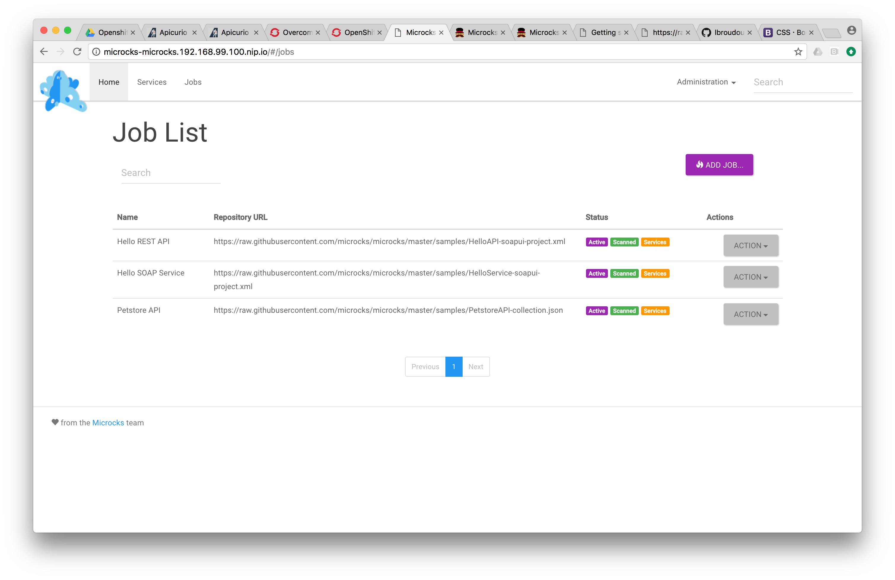
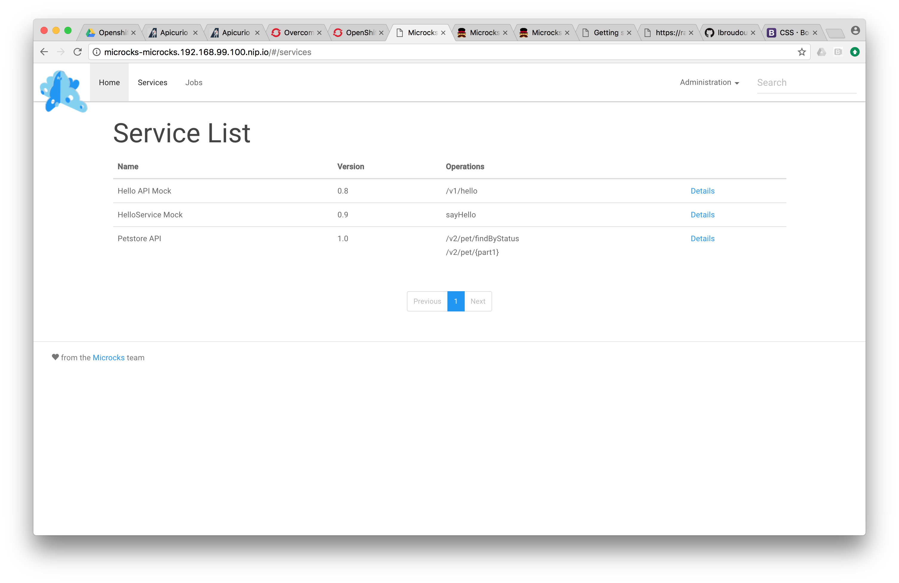
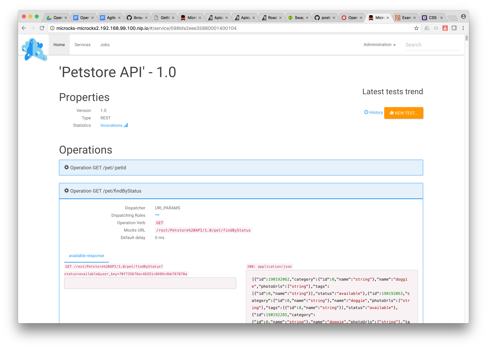

	

		

       <h2 class="page-title arvo">Getting started</h2>
    

	

  

		On this page, you will go through :
		<ul>
			<li><a href="#installation">Installing Microcks</a>,</li>
			<li><a href="#using">Using Microcks</a>,</li>
			<li><a href="#next">Going further...</a>,</li>
		</ul>
		<section id="installation" class="article">
			<h2 class="arvo">Installing Microcks</h2>
			

				Microcks may be installed in many ways depending your preferred environment. Basically, it can be installed on Kubernetes, on OpenShift, using Docker-Compose or directly using binary and source of Microcks.
			

			<h3 class="arvo">Installing on Kubernetes</h3>
			

				We provide <a href="https://raw.githubusercontent.com/microcks/microcks/master/install/kubernetes/kubernetes-ephemeral-full.yml">basic Kubernetes manifest</a> for simple needs but also a <code>Chart</code> for using with <a href="https://helm.sh/">Helm</a> Packet Manager. This is definitely the preferred way of installing apps on Kubernetes.
			

			

				Have a look on this <a href="../installing/kubernetes">page</a> for more informations.
			

			<h3 class="arvo">Installing on OpenShift</h3>
			

				We provide OpenShift templates in many flavors for rapid deployment onto OpenShift. We will basically have different installation options:<ul>
					<li>Ephemeral or Persistent setup,</li>
					<li>Embedding Keycloak or using an external mutualized instance,</li>
					<li>With or without HTTPS Routes setup.</li>
				</ul>
			
				Have a look on this <a href="../installing/kubernetes">page</a> for more informations.
			

			<h3 class="arvo">Installing using Docker Compose</h3>
			

				Docker Compose is really easy for a laptop or single demonstration server. You'll find instructions on how to use Docker Compose for installation <a href="../installing/docker-compose">here</a>.
			

			

				Using this deployment solution, we also provide one-click deployment to Microsoft Azure Cloud with this <a href="https://github.com/microcks/microcks-azure">sub-project</a>.
			

		</section>

		<section id="using" class="article">
			<h2 class="arvo">Using Microcks</h2>
			

				Now you are ready to use Microcks for deploying your own services and API mocks! Before that let's have the look at the application home screen and introduce the main concepts. Using the application URL after installation, we should land on this page with 2 main entry points : <b>Services</b> and <b>Jobs</b>.
			

			
			

				As you may have guessed, <b>API | Services</b> is about browsing your [micro]-services and API repository, discovering and accessing documentation, mocks and tests. <b>Importers</b> is another concept dedicated on how to fill this repository: it allows to define Jobs periodically scan your Git or Subversion repository for checking new definition files that will be parsed and integrated as part of your [micro]-services and API repository. Indeed <b>Importers</b> help discover new or modified <b>Services</b>. Before creating your own service definition files, let load some samples into Microcks for a test ride.
			

			<h3 class="arvo">Loading samples</h3>
			

				We provide different samples that illustrate different ways of creating service definitions. The 2 firsts are definition files realized using SoapUI and demonstrating SOAP and REST services. The third one is a definition file built using Postman and demonstrating the famous Petstore API. Using the <b>Importers</b> entry point from home screen or top navigation bar, use the Importers management page to add 3 new jobs. For each, you will be asked a name and a repository URL. Use the informations below:
				<ul>
					<li>Hello SOAP Service : <code>https://raw.githubusercontent.com/microcks/microcks/master/samples/HelloService-soapui-project.xml</code></li>
					<li>Hello REST API : <code>https://raw.githubusercontent.com/microcks/microcks/master/samples/HelloAPI-soapui-project.xml</code></li>
					<li>Petstore API : <code>https://raw.githubusercontent.com/microcks/microcks/master/samples/PetstoreAPI-collection.json</code></li>
				</ul>
				Now that you have created your Jobs, you have to <code>Activate</code> them (this make them eligible to a periodically check) and to <code>Force import</code> them (this make a forced refresh right now). After some moments and a page refresh, you should see the status of Jobs changed like in screenshot below:
			

			

			<h3 class="arvo">Viewing services</h3>
			

				Once sample jobs have been loaded, new Services has been discovered and added to your repository. You can now visit the <b>API | Services</b> entry point from top navigation bar or home screen. You should see 3 new services with basic informations on version and operations/resources handled by this services.
			

			

			<h3 class="arvo">Viewing details</h3>
			

				Now choosing the <b>Petstore API</b> REST API, you'll be able to access details, documentation and request/response samples for each operation/resource in the screen below. One important information here is the <b>Mocks URL</b> field: this is the endpoint where Microcks automatically deploy a mock for this operation. The table just below show request/response couples and a detailed URL with the HTTP verb showing how to invoke this mock.
			

			
			

				Using this URL, you can call the exposed mock for <b>Petstore API</b> using the following curl command :  
				<code>curl "http://microcks-microcks.192.168.99.100.nip.io/rest/Petstore+API/1.0/pet/findByStatus?status=available&user_key=70f735676ec46351c6699c4bb767878a"</code>  

				And you should receive the following response :  
				<code>[{"id":190192062,"category":{"id":0,"name":"string"},"name":"doggie","photoUrls":["string"],"tags":[{"id":0,"name":"string"}],"status":"available"},{"id":190192063,"category":{"id":0,"name":"string"},"name":"doggie","photoUrls":["string"],"tags":[{"id":0,"name":"string"}],"status":"available"},{"id":190192285,"category":{"id":0,"name":"string"},"name":"doggie","photoUrls":["string"],"tags":[{"id":0,"name":"string"}],"status":"available"},{"id":190192654,"category":{"id":0,"name":"string"},"name":"doggie","photoUrls":["string"],"tags":[{"id":0,"name":"string"}],"status":"available"},{"id":190192671,"category":{"id":0,"name":"string"},"name":"doggie","photoUrls":["string"],"tags":[{"id":0,"name":"string"}],"status":"available"},{"id":190192727,"category":{"id":0,"name":"string"},"name":"doggie","photoUrls":["string"],"tags":[{"id":0,"name":"string"}],"status":"available"},{"id":190192736,"category":{"id":0,"name":"string"},"name":"doggie","photoUrls":["string"],"tags":[{"id":0,"name":"string"}],"status":"available"},{"id":190192768,"category":{"id":0,"name":"string"},"name":"doggie","photoUrls":["string"],"tags":[{"id":0,"name":"string"}],"status":"available"},{"id":190192878,"category":{"id":0,"name":"string"},"name":"doggie","photoUrls":["string"],"tags":[{"id":0,"name":"string"}],"status":"available"},{"id":190192907,"category":{"id":0,"name":"string"},"name":"doggie","photoUrls":["string"],"tags":[{"id":0,"name":"string"}],"status":"available"},{"id":190193000,"category":{"id":0,"name":"string"},"name":"doggie","photoUrls":["string"],"tags":[{"id":0,"name":"string"}],"status":"available"},{"id":-98125093,"category":{"id":-517488397,"name":"EJvNbK"},"name":"LuEfMZATrHz","photoUrls":["XCXOVVkaxa","gNwYqHEmC","nvCvphDeuqztysUBNed","W","vmrxRIViyXqumolLIeoB","JRqHVxk","tCUGbegVHoXajm","UiHppQn"],"tags":[{"id":727599428,"name":"RemggEDzxPljbrlktdWf"},{"id":1987753751,"name":"zWqdKAGHMmhPPlomljaNtuvm"},{"id":1251632392,"name":"BAgtgtKOxZGdsS"},{"id":-1813025208,"name":"OkKxtfAkCMEICbbQDVPi"},{"id":-730110346,"name":"WshDF"},{"id":2100951153,"name":"yxUFSknQEleIAQCoocl"},{"id":-2135188117,"name":"M"},{"id":1352243140,"name":"koKHsjysHXW"},{"id":1696778814,"name":"KaihiyarcZkIzkkquWPZ"},{"id":659492963,"name":"xqIzulcBPzWMyUpQwQK"},{"id":-2118372841,"name":"naYFGuHmqDqOpfHH"}],"status":"available"},{"id":8739826599258110549,"category":{"id":0,"name":"string"},"name":"doggie","photoUrls":["string"],"tags":[{"id":0,"name":"string"}],"status":"available"}]%</code> 
			

			

				Ta Dam !
			

		</section>

		<section id="next" class="article">
			<h2 class="arvo">What's next?</h2>
			

				Now that you have basic information on how to setup and use Microcks, you can go further with :
				<ul>
					<li>Understand how Microcks <a href="../using/alternatives">compare to alternatives</a>,</li>
					<li>Creating your definition files using <a href="../using/soapui">SoapUI</a> or <a href="../using/postman">Postman</a>,</li>
					<li>Using <a href="../using/mocks">exposed mocks</a> and using variables,</li>
					<li>Executing your <a href="../using/tests">tests on endpoints</a> where your services and API are deployed,</li>
					<li>Using <a href="../using/admin">advanced features</a> of Microcks and admin stuffs.</li>
				</ul>
			

		</section>
  

