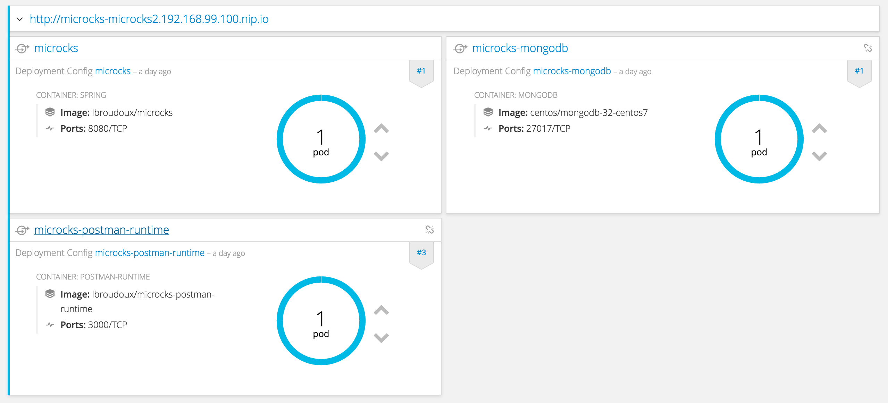

	

		

       <h2 class="page-title arvo">Getting started</h2>
    

	

  

		On this page, you will go through :
		<ul>
			<li><a href="#installation">Installing Microcks</a>,</li>
			<li><a href="#using">Using Microcks</a>,</li>
			<li><a href="#next">Going further...</a>,</li>
		</ul>
		<section id="installation" class="article">
			<h2 class="arvo">Installing Microcks</h2>
			

				Microcks may be installed in many ways depending your preferred environment. Basically, it can be installed on Kubernetes, on OpenShift, using Docker-Compose or directly using binary and source of Microcks.
			

			<h3 class="arvo">Installing on Kubernetes</h3>
			

				One easy way if installing Microcks is to do it on Kubernetes. Kubernetes in version 1.6 or greater is required. It is assumed that you have some kind of Kubernetes cluster up and running available. This can take several forms depending on your environment and needs :
				<ul>
					<li>Lightweight Minikube on your laptop, see <a href="https://github.com/kubernetes/minikube">Minikube project page</a>,</li>
					<li>Google Cloud Engine account in the cloud, see how to start a <a href="https://console.cloud.google.com/freetrial">Free trial</a>,</li>
					<li>Any other Kubernetes distribution provider.</li>
				</ul>

				We provide <a href="https://raw.githubusercontent.com/microcks/microcks/master/install/kubernetes/kubernetes-ephemeral-full.yml">basic Kubernetes manifest</a> for simple needs but also a <code>Chart</code> for using with <a href="https://helm.sh/">Helm</a> Packet Manager. This is definitely the preferred way of installing apps on Kubernetes. 

				Just clone the GitHub repository, go to Helm directory and install the chart with these commands: 
				<code>git clone https://github.com/microcks/microcks.git</code> 
				<code>cd microcks/install/kubernetes/helm</code> 
				<code>helm install ./microcks --name microcks --namespace=microcks</code> 

				 
				After some minutes and components have been deployed, you should end up with a Spring-boot Pod, a MongoDB Pod, a Postman-runtime Pod, a Keycloak Pod and a PostgreSQL Pod like in the screenshot below. 
			

			
			

				Now you can retrieve the URL of the created ingress using <code>kubectl get ingress -n microcks</code>. Before starting playing with Microcks, you'll have to connect to Keycloak component in order to configure an identity provider or define some users for the Microcks realm (see <a href="http://www.keycloak.org/docs/latest/server_admin/index.html#user-management">Keycloak documentation</a>). Connection to Keycloak can be done using username and password stored into a <code>microcks-keycloak-config</code> secret created during setup.
			

			<h3 class="arvo">Installing on OpenShift</h3>
			

				The easiest way of installing Microcks for production use in most secured conditions is to do it on OpenShift. OpenShift in version 3.6 or greater is required. It is assumed that you have some kind of OpenShift cluster instance running and available. This instance can take several forms depending on your environment and needs :
				<ul>
					<li>Full blown OpenShift cluster at your site, see how to <a href="https://docs.openshift.com/container-platform/3.3/install_config/index.html">Install OpenShift at your site</a>,</li>
					<li>Red Hat Container Development Kit on your laptop, see how to <a href="http://developers.redhat.com/products/cdk/get-started/">Get Started with CDK</a>,</li>
					<li>Lightweight Minishift on your laptop, see <a href="https://github.com/minishift/minishift">Minishift project page</a>.</li>
				</ul>

				<blockquote>
					When running on OpenShift, take care that you did not have the <code>anyuid</code> capability enabled. This prevents Microcks from using OpenShift internal Identity Provider. <code>anyuid</code> addon is enabled by default on Red Hat CDK. You may want to turn it off by executing <code>oc adm policy remove-scc-from-group anyuid system:authenticated</code> as this is a bad practice.
				</blockquote>

				Then you have to ensure that Microcks templates for OpenShift are added and available into your Cluster. Templates come in 2 flavors: ephemeral or persistent. In persistent mode, template will claim a persistent volume during instanciation, such a volume should be available to your team / project on OpenShift cluster. Add the templates, by using these commands : 
				<code>oc create -f https://raw.githubusercontent.com/microcks/microcks/master/install/openshift/openshift-ephemeral-full-template.yml -n openshift</code> 
				<code>oc create -f https://raw.githubusercontent.com/microcks/microcks/master/install/openshift/openshift-persistent-full-template.yml -n openshift</code> 

				 
				Once this is done can now create a new project and instanciate the template of your choice ; either using the OpenShift web console or the command line. You will need to fill up some parameters during creation such as:<ul>
				 	<li>the hostname for routes serving Microcks and embedded Keycloak (typically <code>component_name-project-app_domain</code>),</li>
					<li>the URL for joining OpenShift Master,</li>
					<li>a name for an OAuth Client that will be created apart the app creation.</li>
				</ul>
				Typically, you'll got this kind of commands for a local Minishift instance:  
				<code>oc new-project microcks --display-name="Microcks"</code> 
				<code>oc new-app --template=microcks-persistent --param=APP_ROUTE_HOSTNAME=microcks-microcks.192.168.99.100.nip.io --param=KEYCLOAK_ROUTE_HOSTNAME=keycloak-microcks.192.168.99.100.nip.io --param=OPENSHIFT_MASTER=https://192.168.99.100:8443 --param=OPENSHIFT_OAUTH_CLIENT_NAME=microcks-client</code> 

				 
				After some minutes and components have been deployed, you should end up with a Spring-boot Pod, a MongoDB Pod, a Postman-runtime Pod, a Keycloak Pod and a PostgreSQL Pod like in the screenshot below. 
			

			
			

				 Now you can retrieve the URL of the created route using <code>oc get routes</code> command and navigate to this URL to get started with Microcks. Depending on your environment, URL should be something like <code>http://microcks-microcks.192.168.99.100.nip.io</code>. By default, Microcks integrates with OpenShift identity provider through the use of Keycloak but you may configure some other providers later.
			

			<h3 class="arvo">Installing using Docker Compose</h3>
			

				For those of you familiar with simple Docker Compose, a <source>docker-compose</source> file is available within GitHub repository and can be used to rapidly test up things. First step is to clone the repository and then to execute docker-compose with local clone like in this commands :  
				<code>git clone https://github.com/microcks/microcks.git</code> 
				<code>cd microcks/install/docker-compose</code> 
				<code>docker-compose -f microcks.yml up -d</code> 

				 
				After some minutes and components have been deployed, you should end up with a Spring-boot container, a MongoDB container, a Postman-runtime and a Keycloak container like in the trace below. The default user is <code>admin</code> with <code>123</code> password. The Microcks application is now available on <code>http://localhost:8080</code> URL.
				<pre><code>
» docker ps
CONTAINER ID        IMAGE                                      COMMAND                  CREATED             STATUS              PORTS                    NAMES
6a563e9d87c1        microcks/microcks:latest                  "/bin/sh -c 'exec ..."   6 days ago          Up 33 seconds       0.0.0.0:8080->8080/tcp   microcks
162e99a97a6f        microcks/microcks-postman-runtime:latest   "node app.js"            6 days ago          Up 39 seconds       3000/tcp                 microcks-postman-runtime
b3cb4840597b        mongo:3.3.12                               "/entrypoint.sh mo..."   6 days ago          Up 39 seconds       27017/tcp                microcks-mongo
949e0b9bdac6        jboss/keycloak:3.4.0.Final                 "/opt/jboss/docker..."   6 days ago          Up 38 seconds       0.0.0.0:8180->8080/tcp   microcks-keycloak
				</code></pre>
			

			<h3 class="arvo">Building from binary/sources</h3>
			

				To Do ...
			

		</section>

		<section id="using" class="article">
			<h2 class="arvo">Using Microcks</h2>
			

				Now you are ready to use Microcks for deploying your own services and API mocks! Before that let's have the look at the application home screen and introduce the main concepts. Using the application URL after installation, we should land on this page with 2 main entry points : <b>Services</b> and <b>Jobs</b>.
			

			
			

				As you may have guessed, <b>Services</b> is about browsing your [micro]-services and API repository, discovering and accessing documentation, mocks and tests. <b>Jobs</b> is another concept dedicated on how to fill this repository: it allows to periodically scan your Git or Subversion repository for checking new definition files that will be parsed and integrated as part of your [micro]-services and API repository. Indeed <b>Jobs</b> help discover new or modified <b>Services</b>. Before creating your own service definition files, let load some samples into Microcks for a test ride.
			

			<h3 class="arvo">Loading samples</h3>
			

				We provide different samples that illustrate different ways of creating service definitions. The 2 firsts are definition files realized using SoapUI and demonstrating SOAP and REST services. The third one is a definition file built using Postman and demonstrating the famous Petstore API. Using the <b>Jobs</b> entry point from home screen or top navigation bar, use the Job management page to add 3 new jobs. For each, you will be asked a name and a repository URL. Use the informations below:
				<ul>
					<li>Hello SOAP Service : <code>https://raw.githubusercontent.com/microcks/microcks/master/samples/HelloService-soapui-project.xml</code></li>
					<li>Hello REST API : <code>https://raw.githubusercontent.com/microcks/microcks/master/samples/HelloAPI-soapui-project.xml</code></li>
					<li>Petstore API : <code>https://raw.githubusercontent.com/microcks/microcks/master/samples/PetstoreAPI-collection.json</code></li>
				</ul>
				Now that you have created your Jobs, you have to <code>Activate</code> them (this make them eligible to a periodically check) and to <code>Start</code> them (this make a forced refresh right now). After some moments and a page refresh, you should see the status of Jobs changed like in screenshot below:
			

			

			<h3 class="arvo">Viewing services</h3>
			

				Once sample jobs have been loaded, new Services has been discovered and added to your repository. You can now visit the <b>Services</b> entry point from top navigation bar or home screen. You should see 3 new services with basic informations on version and operations/resources handled by this services.
			

			

			<h3 class="arvo">Viewing details</h3>
			

				Now choosing the <b>Petstore API</b> microservice, you'll be able to access details, documentation and request/response samples for each operation/resource in the screen below. One important information here is the <b>Mocks URL</b> field: this is the endpoint where Microcks automatically deploy a mock for this operation. The table just below show request/response couples and a detailed URL with the HTTP verb showing how to invoke this mock.
			

			
			

				Using this URL, you can call the exposed mock for <b>Petstore API</b> using the following curl command :  
				<code>curl "http://microcks-microcks.192.168.99.100.nip.io/rest/Petstore%20API/1.0/pet/findByStatus?status=available&user_key=70f735676ec46351c6699c4bb767878a"</code>  

				And you should receive the following response :  
				<code>[{"id":190192062,"category":{"id":0,"name":"string"},"name":"doggie","photoUrls":["string"],"tags":[{"id":0,"name":"string"}],"status":"available"},{"id":190192063,"category":{"id":0,"name":"string"},"name":"doggie","photoUrls":["string"],"tags":[{"id":0,"name":"string"}],"status":"available"},{"id":190192285,"category":{"id":0,"name":"string"},"name":"doggie","photoUrls":["string"],"tags":[{"id":0,"name":"string"}],"status":"available"},{"id":190192654,"category":{"id":0,"name":"string"},"name":"doggie","photoUrls":["string"],"tags":[{"id":0,"name":"string"}],"status":"available"},{"id":190192671,"category":{"id":0,"name":"string"},"name":"doggie","photoUrls":["string"],"tags":[{"id":0,"name":"string"}],"status":"available"},{"id":190192727,"category":{"id":0,"name":"string"},"name":"doggie","photoUrls":["string"],"tags":[{"id":0,"name":"string"}],"status":"available"},{"id":190192736,"category":{"id":0,"name":"string"},"name":"doggie","photoUrls":["string"],"tags":[{"id":0,"name":"string"}],"status":"available"},{"id":190192768,"category":{"id":0,"name":"string"},"name":"doggie","photoUrls":["string"],"tags":[{"id":0,"name":"string"}],"status":"available"},{"id":190192878,"category":{"id":0,"name":"string"},"name":"doggie","photoUrls":["string"],"tags":[{"id":0,"name":"string"}],"status":"available"},{"id":190192907,"category":{"id":0,"name":"string"},"name":"doggie","photoUrls":["string"],"tags":[{"id":0,"name":"string"}],"status":"available"},{"id":190193000,"category":{"id":0,"name":"string"},"name":"doggie","photoUrls":["string"],"tags":[{"id":0,"name":"string"}],"status":"available"},{"id":-98125093,"category":{"id":-517488397,"name":"EJvNbK"},"name":"LuEfMZATrHz","photoUrls":["XCXOVVkaxa","gNwYqHEmC","nvCvphDeuqztysUBNed","W","vmrxRIViyXqumolLIeoB","JRqHVxk","tCUGbegVHoXajm","UiHppQn"],"tags":[{"id":727599428,"name":"RemggEDzxPljbrlktdWf"},{"id":1987753751,"name":"zWqdKAGHMmhPPlomljaNtuvm"},{"id":1251632392,"name":"BAgtgtKOxZGdsS"},{"id":-1813025208,"name":"OkKxtfAkCMEICbbQDVPi"},{"id":-730110346,"name":"WshDF"},{"id":2100951153,"name":"yxUFSknQEleIAQCoocl"},{"id":-2135188117,"name":"M"},{"id":1352243140,"name":"koKHsjysHXW"},{"id":1696778814,"name":"KaihiyarcZkIzkkquWPZ"},{"id":659492963,"name":"xqIzulcBPzWMyUpQwQK"},{"id":-2118372841,"name":"naYFGuHmqDqOpfHH"}],"status":"available"},{"id":8739826599258110549,"category":{"id":0,"name":"string"},"name":"doggie","photoUrls":["string"],"tags":[{"id":0,"name":"string"}],"status":"available"}]%</code> 
			

			

				Ta Dam !
			

		</section>

		<section id="next" class="article">
			<h2 class="arvo">What's next?</h2>
			

				Now that you have basic information on how to setup and use Microcks, you can go further with :
				<ul>
					<li>Understand how Microcks <a href="../using/alternatives">compare to alternatives</a>,</li>
					<li>Creating your definition files using <a href="../using/soapui">SoapUI</a> or <a href="../using/postman">Postman</a>,</li>
					<li>Using <a href="../using/mocks">exposed mocks</a> and using variables,</li>
					<li>Executing your <a href="../using/tests">tests on endpoints</a> where your services and API are deployed,</li>
					<li>Using <a href="../using/admin">advanced features</a> of Microcks and admin stuffs.</li>
				</ul>
			

		</section>
  

